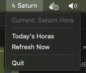
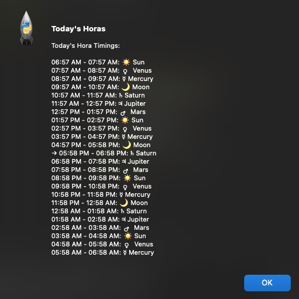

# Daily Hora Timings - macOS Menu Bar Widget

A native macOS menu bar application that displays daily Vedic astrology hora timings with automatic updates. Features a beautiful widget interface that shows the current planetary hora in your menu bar.

**Data powered by [Free Astrology API](https://freeastrologyapi.com)**

## Screenshots

### Menu Bar Widget

The widget lives in your macOS menu bar showing the current hora with planet emoji:



Click the widget to see the dropdown menu with current hora information and options to view all horas or refresh data.

### All Horas View

View all 24 horas for the day with planet emojis, timing details, and the current hora highlighted:



The popup shows each hora with:
- Planet emoji for each hora lord (☀️ Sun, 🌙 Moon, ♂️ Mars, ☿️ Mercury, ♃ Jupiter, ♀️ Venus, ♄ Saturn)
- Start and end times
- Current hora highlighted with "● CURRENT" indicator

## Features

- 🕉️ **Native macOS Menu Bar Widget** - Lives in your menu bar like system apps
- ⏰ **Auto-updates every minute** - Always shows current hora
- 📅 **Daily automatic refresh** - Fetches new data at 6 AM using launchd
- 🌟 **Planet emojis** - Visual representation of each hora lord
- 💾 **Efficient caching** - Only 1 API call per day
- 🔔 **Native notifications** - macOS notifications for updates
- 🎯 **Current hora highlighting** - Easy to see which hora is active

## Prerequisites

- macOS (tested on macOS 10.13+)
- Python 3.7 or higher
- Free Astrology API key from [freeastrologyapi.com](https://freeastrologyapi.com)

## Setup

### 1. Install Dependencies

```bash
# Create a virtual environment (recommended)
python3 -m venv venv

# Activate the virtual environment
source venv/bin/activate

# Install required packages
pip install -r requirements.txt
```

### 2. Configure Your API Key and Location

Create a `.env` file in the project directory:

```bash
# Your Free Astrology API key (get one from freeastrologyapi.com)
ASTROLOGY_API_KEY=your_api_key_here

# Your location coordinates (default: Austin, TX)
LATITUDE=30.2672
LONGITUDE=-97.7431
TIMEZONE=-6
```

**Note:** Never commit your `.env` file or API key to version control!

### 3. Set Up Automatic Daily Updates

The project includes a launchd configuration that automatically fetches new hora data at 6:00 AM daily.

```bash
# Copy the plist file to LaunchAgents
cp com.horafetcher.plist ~/Library/LaunchAgents/

# Load the scheduled job
launchctl load ~/Library/LaunchAgents/com.horafetcher.plist

# Verify it's loaded
launchctl list | grep horafetcher
```

**What this does:** Your Mac will automatically fetch fresh hora data every morning at 6 AM, even if the app isn't running.

### 4. Build the macOS Application (Optional but Recommended)

Instead of running from terminal every time, you can build a native macOS app that you can launch like any other application.

```bash
# Run the build script
./build_app.sh
```

This creates `dist/Hora Widget.app` - a proper macOS application!

**Next, install it:**

```bash
# Copy to your Applications folder
cp -r "dist/Hora Widget.app" /Applications/

# Or just double-click "Hora Widget.app" in the dist folder to run it directly
```

That's it! Now you can launch "Hora Widget" from your Applications folder or Spotlight search.

## How to Use the Widget

### Option 1: Using the App (Easiest - Recommended)

1. **Launch the app:**
   - Open Spotlight (press `Cmd + Space`)
   - Type "Hora Widget"
   - Press Enter

2. **Find it in your menu bar:**
   - Look at the top-right of your screen
   - You'll see 🕉️ or a planet emoji (☀️, 🌙, etc.)

3. **Click the icon to:**
   - See the current hora
   - View "Today's Horas" - shows all 24 horas with current one highlighted
   - Click "Refresh Now" to fetch new data
   - Click "Quit" to close the app

4. **Make it start automatically on login (Optional):**
   - Open System Preferences → Users & Groups → Login Items
   - Click the + button
   - Navigate to Applications and add "Hora Widget"

### Option 2: Running from Terminal

If you prefer not to build the app, you can run directly from terminal:

```bash
# Make sure you're in the project directory
cd /path/to/hora

# Activate virtual environment
source venv/bin/activate

# Load environment variables and run the widget
export $(cat .env | xargs) && python hora_gui.py
```

Press `Ctrl+C` in the terminal to stop the widget.

## Manual Fetch (Without Widget)

If you just want to fetch today's hora data without running the widget:

```bash
# Activate virtual environment
source venv/bin/activate

# Load environment variables and run fetcher
export $(cat .env | xargs) && python hora_fetcher.py
```

This saves the data to `hora_results.json` which the widget reads.

## Understanding What Hora Means

**Hora** (or *Hōrā*) is a Vedic astrology concept where each day is divided into 24 planetary hours. Each hora is ruled by one of the seven classical planets:

- ☀️ **Sun** - Success, authority, government work
- 🌙 **Moon** - Home, family, emotional matters  
- ♂️ **Mars** - Courage, surgery, property matters
- ☿️ **Mercury** - Communication, learning, business
- ♃ **Jupiter** - Wisdom, teaching, legal matters
- ♀️ **Venus** - Love, arts, beauty, luxury
- ♄ **Saturn** - Hard work, discipline, obstacles

The widget shows you which planetary hora is currently active, helping you time activities according to Vedic principles.

## Troubleshooting

### "Command not found: python"
Use `python3` instead of `python` in all commands.

### "API key not provided" error
1. Make sure `.env` file exists in the project folder
2. Check that it contains: `ASTROLOGY_API_KEY=your_actual_key`
3. Make sure you're running: `export $(cat .env | xargs)` before the python command

### Widget not showing in menu bar
1. Make sure the script is still running (check your terminal)
2. Give macOS a few seconds - sometimes it takes a moment to appear
3. Try quitting and relaunching

### "No data found" when opening widget
Run the fetcher first to get initial data:
```bash
source venv/bin/activate
export $(cat .env | xargs) && python hora_fetcher.py
```

### Build failed when running ./build_app.sh
Make sure py2app is installed:
```bash
source venv/bin/activate
pip install py2app
```

### Can't open the app - "unidentified developer" warning
1. Right-click (or Control-click) on "Hora Widget.app"
2. Select "Open"
3. Click "Open" in the dialog
4. macOS will remember your choice

## Advanced: Rebuilding the App

If you make changes to the code and want to rebuild the app:

```bash
# Clean old build and rebuild
./build_app.sh

# Then copy to Applications again
cp -r "dist/Hora Widget.app" /Applications/
```

## Managing the Scheduled Job

The scheduled job runs automatically at 6 AM daily. Here's how to manage it:

```bash
# Check if the job is running
launchctl list | grep horafetcher

# Stop the scheduled job
launchctl unload ~/Library/LaunchAgents/com.horafetcher.plist

# Start the scheduled job again
launchctl load ~/Library/LaunchAgents/com.horafetcher.plist

# Run the job immediately (for testing)
launchctl start com.horafetcher

# View what happened during scheduled runs
tail -f hora_cron.log          # Normal output
tail -f hora_cron_error.log    # Errors (if any)
```

## File Structure

```
hora/
├── hora_fetcher.py          # Core API fetcher script  
├── hora_gui.py              # macOS menu bar widget application
├── setup.py                 # Configuration for building the app
├── build_app.sh            # Script to build the macOS app
├── requirements.txt         # Python dependencies
├── com.horafetcher.plist    # launchd configuration for scheduled fetching
├── .env                     # Environment variables (API key, coordinates) - NOT in git
├── .env.example             # Template for .env file
├── hora_results.json        # Cached hora data - NOT in git
├── hora_cron.log           # Scheduled job output log - NOT in git
├── hora_cron_error.log     # Scheduled job error log - NOT in git
├── dist/                    # Built application folder - NOT in git
│   └── Hora Widget.app      # The macOS application
├── screenshots/             # Screenshots of the widget
└── README.md               # This file
├── hora_cron_error.log     # Scheduled job error log
└── README.md               # This file
```

## API Response Format

The Free Astrology API returns hora timings in the following format:

```json
{
  "statusCode": 200,
  "output": {
    "1": {
      "lord": "Sun",
      "starts_at": "2025-11-16 06:57:38",
      "ends_at": "2025-11-16 07:57:40.125000"
    },
    "2": {
      "lord": "Venus",
      "starts_at": "2025-11-16 07:57:40.125000",
      "ends_at": "2025-11-16 08:57:42.250000"
    }
    // ... 24 horas total
  },
  "fetched_at": "2025-11-16T17:46:48.166863"
}
```

Each day contains 24 horas, with each hora lasting approximately 1 hour.

## Customization

### Changing Location

Edit the `.env` file with your city's coordinates:

```bash
# Example: New York City
LATITUDE=40.7128
LONGITUDE=-74.0060
TIMEZONE=-5
```

### Changing Fetch Time

Edit `com.horafetcher.plist` and change the hour:

```xml
<key>Hour</key>
<integer>6</integer>  <!-- Change to desired hour (0-23) -->
```

Then reload:
```bash
launchctl unload ~/Library/LaunchAgents/com.horafetcher.plist
launchctl load ~/Library/LaunchAgents/com.horafetcher.plist
```

### Changing Update Frequency

Edit `hora_gui.py` line with `time.sleep(60)` to change how often the widget checks for current hora (in seconds).

## Troubleshooting

### Widget not showing in menu bar
- Make sure rumps and PyObjC are installed: `pip install rumps PyObjC`
- Check if Python has accessibility permissions in System Preferences

### "API key not provided" error
- Verify `.env` file exists and contains `ASTROLOGY_API_KEY=your_key`
- Make sure you're exporting variables: `export $(cat .env | xargs)`

### Scheduled job not running
- Check if loaded: `launchctl list | grep horafetcher`
- View error logs: `cat hora_cron_error.log`
- Test manually: `launchctl start com.horafetcher`

### No data at startup
- Run manual fetch first: `python hora_fetcher.py`
- Check `hora_results.json` exists

## API Usage & Limits

**Free Astrology API Limits:**
- 50 requests per day
- 1 request per second

This application is optimized to use only **1 API request per day** (at 6 AM), well within the free tier limits.

## Credits

- **API Provider**: [Free Astrology API](https://freeastrologyapi.com) - Thank you for providing free Vedic astrology data!
- **Menu Bar Framework**: [rumps](https://github.com/jaredks/rumps) - Ridiculously Uncomplicated macOS Python Statusbar apps

## License

This project is open source and available for personal use. Please respect the Free Astrology API terms of service.

## Support

For issues with:
- This application: Open an issue on GitHub
- The Free Astrology API: Visit [freeastrologyapi.com](https://freeastrologyapi.com)
